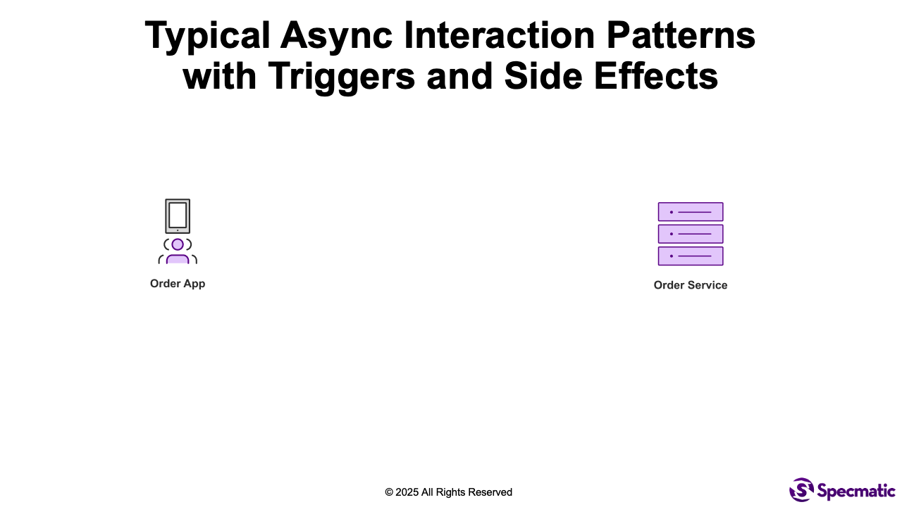

# Testing Event Flows and Behaviors

## Introduction to Event Flows and Behaviors

Testing event-driven systems is fundamentally harder than testing REST APIs. Validating schemas is straightforward, but validating behavior in terms of what the system actually does when it receives or produces an event is still a major challenge. Teams often struggle to trigger their systems reliably, observe side effects, and automate end-to-end event flow testing without custom scripts or brittle harnesses.

Specmatic help you leverage [OpenAPI Overlays](https://spec.openapis.org/overlay/) feature to bring executable behavior into the AsyncAPI ecosystem. Using a simple Overlay file, engineers can define:

- Triggers that stimulate the system (for example, an HTTP call that causes an event to be published), and
- Side effects that must occur when the system consumes an event (such as an emitted message, state change, or downstream API call).

This approach turns an [AsyncAPI specification](https://www.asyncapi.com/) into a fully executable contract test that verifies real event flows, not just schemas. 

We will walk through a practical example of how overlays allow teams to test end-to-end asynchronous workflows in a declarative, CI-friendly manner, without relying on mocks, glue code, or environment-specific hacks.

By end of this tutorial, you will gain a clear understanding of how AsyncAPI and Specmatic can work together to close a long-standing gap in event-driven testing, making it possible to ship reliable, behaviourally correct event-based systems with confidence.


## Business Workflow



## Triggers and Side Effects

### Triggering Event Flows

In the above workflow, when the `Warehouse Service` receives an inventory availability confirmation, it makes an HTTP PUT request on the `Order Service` to inform that the items are available in stock and the order can be accepted. Then the `Order Service` will publish a `OrderAccepted` event on the `accepted-orders` topic.

Now image you want to test if the `Order Service` correctly publishes the `OrderAccepted` event when it receives the HTTP PUT request, but you don't have or don't want to depend on the `Warehouse Service`.

In such cases, we refer to this action of stimulating the `Order Service` without using its dependencies as a "trigger". 

Hence, the expected behavior we are interested in testing is: when we trigger the `Order Service` by invoking the HTTP PUT request it should result in an `OrderAccepted` event being published on the `accepted-orders` topic.

### Side Effects of Event Consumption

Similarly, when the `Shipping App` publishes an `OutForDelivery` event on the `out-for-delivery-orders` topic, the `Order Service` is expected to consume this event and update the order status to "OutForDelivery" in the database.

Here, the database update is referred to as a "side effect" of consuming the `OutForDelivery` event.

Hence, the expected behavior we are interested in testing is: when the `OutForDelivery` event is published on the `out-for-delivery-orders` topic, `Order Service` should correctly update the order status in the database.

## Testing Triggers and Side Effects with Specmatic

### OpenAPI Overlays
[OpenAPI Overlays](/docs/features/overlays) provides a powerful mechanism to modify OpenAPI specifications without altering the base specification.

Even though Overlays were designed to work with OpenAPI, Specmatic can leverage Overlays with AsyncAPI specifications as well to define triggers and side effects for testing event-driven systems.

### AsyncAPI Specification

Here is a simplified AsyncAPI specification for the `Order Service` that defines the relevant channels and messages.

```yaml
asyncapi: 3.0.0
info:
  title: Order Management API
  version: 1.0.0
channels:
  OrderAccepted:
    address: accepted-orders
    messages:
      orderAccepted.message:
        $ref: '#/components/messages/OrderAccepted'
  OrderDeliveryInitiated:
    address: out-for-delivery-orders
    messages:
      orderDeliveryInitiation.message:
        $ref: '#/components/messages/OutForDelivery'
operations:
  orderAccepted:
    action: send
    channel:
      $ref: '#/channels/OrderAccepted'
    messages:
      - $ref: '#/channels/OrderAccepted/messages/orderAccepted.message'
  initiateOrderDelivery:
    action: receive
    channel:
      $ref: '#/channels/OrderDeliveryInitiated'
    messages:
      - $ref: '#/channels/OrderDeliveryInitiated/messages/orderDeliveryInitiation.message'
components:
  messages:
    OrderAccepted:
      name: OrderAccepted
      title: Order accepted by Warehouse
      contentType: application/json
      payload:
        type: object
        properties:
          id:
            type: integer
          status:
            $ref: '#/components/messages/OrderStatus'
          timestamp:
            type: string
        required:
          - id
          - status
          - timestamp
    OutForDelivery:
      name: OutForDelivery
      title: Order is out for delivery
      contentType: application/json
      payload:
        type: object
        required:
          - orderId
          - deliveryAddress
          - deliveryDate
        properties:
          orderId:
            type: integer
          deliveryAddress:
            type: string
          deliveryDate:
            type: string
            format: date
    OrderStatus:
      name: OrderStatus
      title: Order status
      payload:
        type: string
        enum:
          - PENDING
          - INITIATED
          - ACCEPTED
          - SHIPPED
          - DELIVERED
          - CANCELLED
```
### Overlay File
The following Overlay file defines the triggers and side effects for testing the `Order Service`.

```yaml
overlay: 1.0.0
actions:
  - target: $.operations.orderAccepted
    update:
      x-specmatic-trigger:
        type: http
        method: PUT
        url: http://localhost:9000/orders
        expectedStatus: 200
        timeoutInSeconds: 5
        headers:
          Content-Type: application/json
        requestBody: '{"id":123,"status":"ACCEPTED","timestamp":"2025-04-12T14:30:00Z"}'

  - target: $.operations.initiateOrderDelivery
    update:
      x-specmatic-side-effect:
        type: http
        method: GET
        url: http://localhost:9000/orders/123?status=SHIPPED
        expectedStatus: 200
        timeoutInSeconds: 5
```
### Specmatic Configuration

By setting a system property called `SPECMATIC_OVERLAY_FILE` and pointing it to the overlay file path (Ex: "src/test/resources/spec_overlay.yaml") we can let Specmatic know that it needs to apply the above Overlay to our AsyncAPI specification.

On Command Line, this can be done as follows:

```shell
-DSPECMATIC_OVERLAY_FILE=src/test/resources/spec_overlay.yaml
```

In Java, this can be done as follows:

```java
System.setProperty("SPECMATIC_OVERLAY_FILE", "src/test/resources/spec_overlay.yaml");
```

### Running the Tests

Now when you run Specmatic tests using the AsyncAPI spec against the `Order Service`, it will automatically apply the triggers and side effects defined in the Overlay file. You can see the following in the test output:

```terminaloutput
[Specmatic::Test] Starting test >> Should send a message on 'accepted-orders' channel.

[Specmatic::Test] Subscribing to the topics: 'accepted-orders'...
[Specmatic::Test] Subscriber started listening to 'accepted-orders'
[Specmatic::Test] Waiting for a message on topic 'accepted-orders'...
[Specmatic::Test] Attempting to trigger event using 'x-specmatic-trigger'
[Specmatic::Test] Executing HTTP hook: method=PUT, url=http://localhost:9000/orders, expectedStatus=200, expectedBody=null, headers={Content-Type=application/json}, body={"id":123,"status":"ACCEPTED","timestamp":"2025-04-12T14:30:00Z"}

[OrderController] Received update request: OrderUpdateRequest(id=123, status=ACCEPTED, timestamp=2025-04-12T14:30:00Z)
[OrderAcceptanceService] Publishing the acceptance message on topic 'accepted-orders'..

[Specmatic::Test] HTTP response received: status=200, body='Notification triggered.'
[Specmatic::Test] HTTP hook execution succeeded.
[Specmatic::Test] Successfully triggered the event using 'x-specmatic-trigger'.

[Specmatic::Test] Received a message on topic 'accepted-orders' (match=true):
Timestamp: 2025-04-24T03:30:46.301961Z
Payload: {
    "id": 123,
    "status": "ACCEPTED",
    "timestamp": "2025-04-12T14:30:00Z"
}
Headers: {}

[Specmatic::Test] Result: PASSED
[Specmatic::Test] << Test finished
```

and

```terminaloutput
[Specmatic::Test] Starting test >> Should receive a message on 'out-for-delivery-orders' channel.

[Specmatic::Test] Sending a message on topic 'out-for-delivery-orders':
Timestamp: 2025-04-24T03:30:46.328835Z
Payload: {
    "orderId": 123,
    "deliveryAddress": "1234 Elm Street, Springfield",
    "deliveryDate": "2025-04-14"
}
Headers: {}

[Specmatic::Test] Message published successfully on topic 'out-for-delivery-orders'

[OrderDeliveryService] Received message on topic out-for-delivery-orders - {
    "orderId": 123,
    "deliveryAddress": "1234 Elm Street, Springfield",
    "deliveryDate": "2025-04-14"
}
[OrderDeliveryService] Order with orderId '123' is SHIPPED

[Specmatic] Checking side effect using the hook specified at 'x-specmatic-side-effect'
[Specmatic::Test] Executing HTTP hook: method=GET, url=http://localhost:9000/orders/123?status=SHIPPED, expectedStatus=200, expectedBody=null, headers=null, body=null

[OrderController] Received request to find Order with id '123' and status 'SHIPPED'

[Specmatic::Test] HTTP response received: status=200, body='{"id":123,"orderItems":[],"lastUpdatedDate":"2025-12-24T09:00:34.151505","status":"SHIPPED"}'
[Specmatic::Test] HTTP hook execution succeeded.
[Specmatic::Test] The intended side effect is successful.

[Specmatic::Test] Result: PASSED
[Specmatic::Test] << Test finished
```
### Sample Project
Please have a look at the following sample project to understand how to utilize `Specmatic` for testing event flows and behaviors in your application:
- [specmatic-kafka-sample-asyncapi3](https://github.com/specmatic/specmatic-kafka-sample-asyncapi3)

## Conclusion
By leveraging OpenAPI Overlays with AsyncAPI specifications, Specmatic empowers teams to define and test triggers and side effects in event-driven systems. This approach enables comprehensive end-to-end testing of event flows and behaviors without relying on mocks or brittle test harnesses.