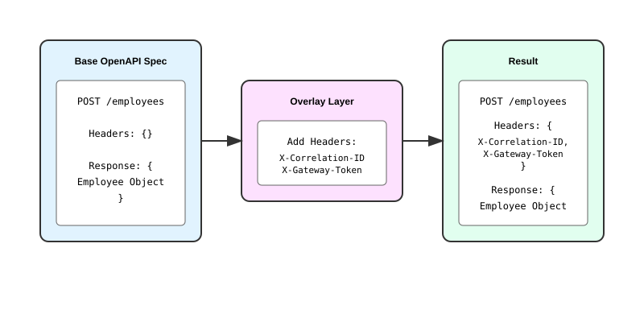
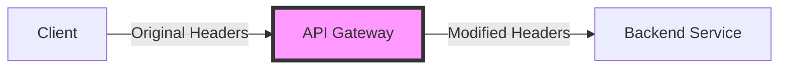

## Overlays

### Introduction
[Overlays](https://www.openapis.org/blog/2024/10/22/announcing-overlay-specification) provide a powerful mechanism to modify OpenAPI specifications without altering the base specification. They're particularly useful when you need to simulate middleware behavior, such as API gateways modifying requests, or when you need to extend an existing API specification.



### Understanding with a Real-World Example

Consider this common scenario in microservices architecture:



In this scenario:
1. A client sends requests to your service through an API gateway
2. The gateway modifies headers (adds new ones, transforms existing ones)
3. Your backend service receives the modified request

### Base Specification
Here's our base employee service specification:

```yaml
openapi: 3.0.0
info:
  title: Employees
  version: '1.0'
servers: []
paths:
  '/employees':
    post:
      summary: Fetch employee details
      tags: []
      parameters:
        - in: header
          name: correlation-id
          schema:
            type: string
          required: true
          description: Request correlation ID
      requestBody:
        required: true
        content:
          application/json:
            schema:
              $ref: '#/components/schemas/Employee'
      responses:
        '200':
          description: Details for employee id in request
          content:
            application/json:
              schema:
                $ref: '#/components/schemas/Employee'
components:
  schemas:
    Employee:
      title: Employee
      type: object
      required:
        - id
        - name
      properties:
        id:
          type: integer
        name:
          type: string
        department:
          type: string
        designation:
          type: string
```

### Overlay Specification
To simulate API gateway behavior, we'll use an overlay to modify headers:

```yaml
overlay: 1.0.0
actions:
  - target: $.paths['/employees'].post
    update:
      parameters:
        - in: header
          name: X-Correlation-ID
          schema:
            type: string
          required: true
          description: Correlation ID for request tracking
        - in: header
          name: X-Gateway-Token
          schema:
            type: string
          required: true
          description: API Gateway authentication token
        - in: header
          name: X-Request-ID
          schema:
            type: string
            format: uuid
          required: true
          description: Unique request identifier for tracing
```

### Using Overlays in Specmatic

#### Step 1: Setting Up Files
1. Save your base specification as `employees.yaml`
2. Save your overlay specification as `gateway_overlay.yaml`

#### Step 2: Specifying Overlay Files

You can specify overlay files in three ways:

1. **Automatic Detection in Test Mode** (Recommended)
  - Name your overlay file following the pattern: `<specname>_overlay.yaml`
  - Place it in the same directory as your spec file
  - Specmatic will automatically detect and apply it when running in test mode

Example:
```bash
  # If your spec file is named:
  employees.yaml

  # Name your overlay file as:
  employees_overlay.yaml
```
Note: The automatic detection is:

Only available in test mode
Case insensitive
Only works with .yaml extension
Requires exact naming pattern with underscore: _overlay.yaml


2. **Command Line Approach**

```shell
  specmatic test --port 9000 --overlay-file gateway_overlay.yaml
```

3. **Environment Variable Approach**

```shell
  export OVERLAY_FILE_PATH=gateway_overlay.yaml
  # Then run your tests programmatically or via command line
````

The environment variable approach is particularly useful when:

Running tests programmatically
Setting up CI/CD pipelines
Working with test frameworks
Need to specify overlays globally for multiple test runs

#### Step 3: Understanding the Results
When Specmatic runs the tests, it will send requests with the modified headers:

```shell
POST /employees
X-Correlation-ID: correlation-123
X-Gateway-Token: gateway-token-456
X-Request-ID: 550e8400-e29b-41d4-a716-446655440000
Content-Type: application/json

{
  "id": 1,
  "name": "John Doe",
  "department": "Engineering",
  "designation": "Senior Engineer"
}
```

### Further Reading
For a complete list of modifications possible with overlays, refer to the [OpenAPI Overlay Specification](https://spec.openapis.org/overlay/v1.0.0.html).